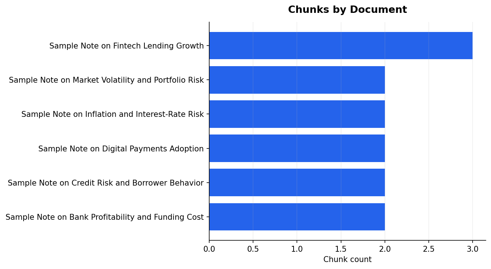
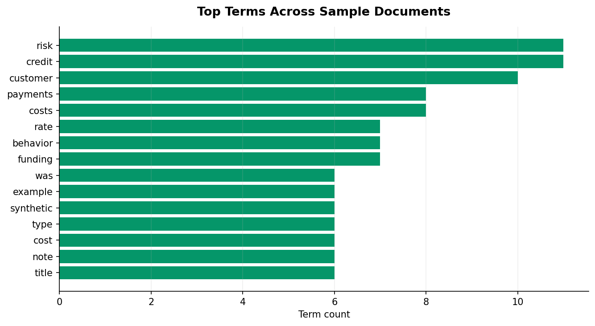
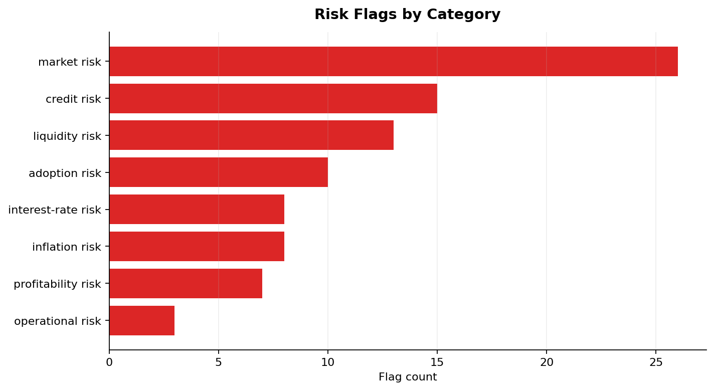
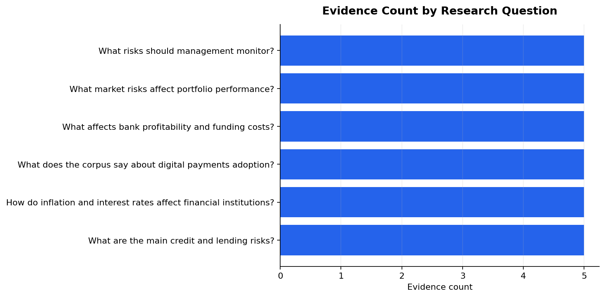
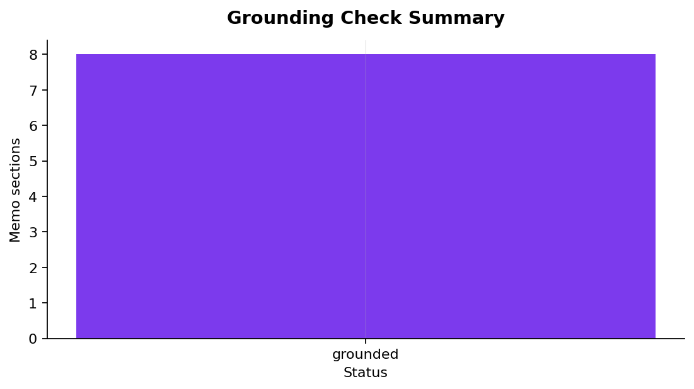

# AI Financial Research Agent

Local finance research prototype that ingests sample documents, retrieves evidence, flags risk themes, and builds a cited research memo without paid APIs or external LLM calls.

**Disclaimer:** This is a portfolio research prototype, not a production investment research system. The documents in `data/sample_docs/` are synthetic examples created for demonstration and should not be treated as real company reports, investment advice, or official policy material.

## Business Problem

Financial analysts, fintech teams, consultants, and risk teams often need to review long document sets while keeping conclusions traceable to source evidence. This project shows a practical first version of that workflow: collect documents, chunk them, retrieve relevant evidence, cite the source chunks, and evaluate whether the memo is grounded.

## Target Roles and Companies

Target roles include finance analytics analyst, fintech analytics analyst, risk analyst, research analyst, AI workflow analyst, consulting analyst, and data analyst.

Target companies include GCash, Maya, ING Hubs Philippines, PwC Philippines, KPMG Philippines, JPMorgan Chase, MSCI, UnionBank, BPI, and startups.

## Methodology

1. **Document ingestion:** Load local `.txt` finance sample documents and create document-level metadata.
2. **Chunking:** Clean text and split each document into overlapping chunks with stable chunk IDs.
3. **TF-IDF retrieval:** Build a local TF-IDF index and retrieve top chunks for finance research questions.
4. **Cited memo workflow:** Convert retrieved chunks into citation-style references such as `[FINLEN-CHUNK001]` and use them in a template-based memo.
5. **Risk flag extraction:** Apply transparent keyword rules for credit, liquidity, interest-rate, inflation, market, operational, profitability, and adoption risks.
6. **Evaluation:** Check retrieval coverage, source traceability, and whether memo citations exist in the evidence table.

No paid APIs, OpenAI API usage, or external LLM services are used.

## Results

- Retrieved evidence for 6 of 6 research questions.
- Produced 30 traceable evidence rows with document and chunk references.
- Grounded 8 of 8 memo sections with citations found in the evidence table.
- Flagged all planned risk categories using local keyword rules.
- Produced a cited research memo in `reports/research_memo.md`.

## Selected Visuals



Document chunk counts by sample finance note.



Most frequent non-stopword terms across the sample corpus.



Keyword-based risk flags found in retrieved evidence.



Retrieved evidence coverage across Phase 1 research questions.



Memo section citation checks against the cited evidence table.

## Key Outputs

- `data/processed/corpus_metadata.csv`
- `outputs/chunks/document_chunks.csv`
- `outputs/retrieval/research_question_retrieval.csv`
- `outputs/retrieval/retrieval_evaluation_summary.csv`
- `outputs/evidence/cited_evidence_table.csv`
- `outputs/evidence/risk_flags.csv`
- `outputs/evidence/memo_section_evidence_map.csv`
- `reports/research_memo.md`
- `reports/prompt_notes.md`
- `reports/evaluation_report.md`

## Repo Structure

```text
ai-financial-research-agent/
  data/
    sample_docs/          Synthetic sample finance documents
    processed/            Regenerated corpus metadata
  notebooks/
    01_document_ingestion_and_retrieval.ipynb
    02_memo_generation_and_evaluation.ipynb
  src/
    ingestion.py          Local document loading
    chunking.py           Text cleaning and chunk creation
    retrieval.py          TF-IDF search and citation tables
    evaluation.py         Risk flags and grounding checks
    visualization.py      Figure helpers
  reports/                Memo, evaluation notes, career outputs, figures
  outputs/                Regenerated chunks, retrieval, and evidence files
  docs/                   Project brief, progress, handoff, known issues
```

## How to Run

```bash
cd projects/ai-financial-research-agent
python3 -m venv .venv
source .venv/bin/activate
pip install -r requirements.txt

python3 -m jupyter nbconvert --to notebook --execute notebooks/01_document_ingestion_and_retrieval.ipynb --output 01_document_ingestion_and_retrieval_executed.ipynb
python3 -m jupyter nbconvert --to notebook --execute notebooks/02_memo_generation_and_evaluation.ipynb --output 02_memo_generation_and_evaluation_executed.ipynb
```

## Generated Artifacts Policy

The project commits source code, notebooks, reports, docs, figures, and sample documents. Processed data and retrieval outputs under `data/processed/` and `outputs/` are ignored by Git because they can be regenerated from the notebooks.

## Limitations

- Synthetic sample documents only.
- Text files only; no production PDF, table, or spreadsheet parser yet.
- TF-IDF retrieval only; no embeddings yet.
- Template-based memo only; no external LLM drafting.
- Keyword risk flags require analyst review.
- Grounding checks confirm citation traceability, not full semantic correctness.
- No dashboard or API layer.

## Future Improvements

- Add real public documents or user-provided reports.
- Add PDF and table parsing.
- Add semantic embeddings after preserving traceability.
- Add claim-level grounding checks.
- Add optional LLM drafting with strict citation guardrails.
- Add a lightweight API or dashboard for evidence review.

## Resume Bullet

Built a local AI financial research prototype in Python that ingests sample finance documents, chunks text, retrieves evidence with TF-IDF, extracts risk flags, and generates a cited memo with retrieval coverage and grounding checks.
