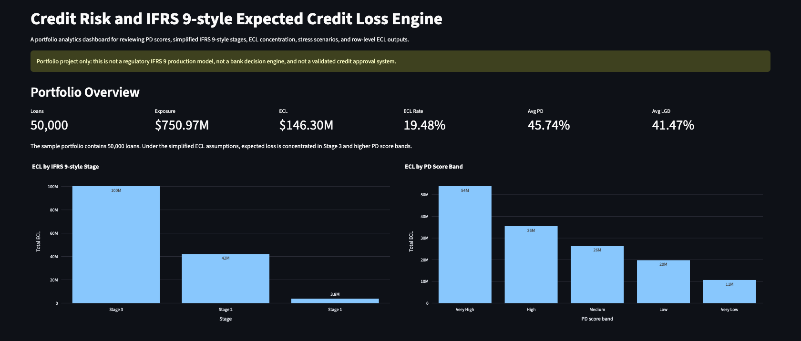
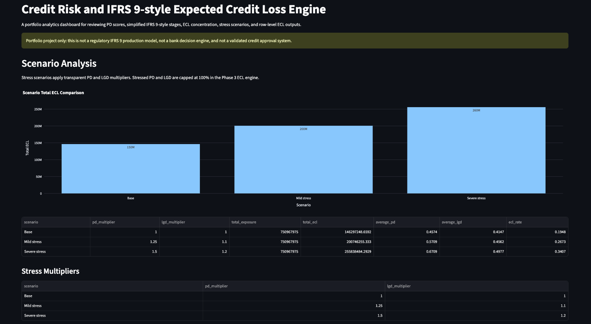

# Credit Risk and IFRS 9 Expected Credit Loss Engine

Python portfolio project that turns LendingClub-style loan data into credit risk analysis, baseline probability of default modeling, simplified IFRS 9-style ECL estimates, stress scenarios, and a Streamlit dashboard.

> This is a portfolio analytics project. It is not a production bank system, credit approval engine, or regulatory IFRS 9 model.

## Why This Project Matters

Banks, fintech lenders, insurers, and advisory teams need analysts who can connect financial risk concepts with data workflows. This project shows the full path from raw loan data to business-ready risk reporting: data review, model development, expected loss logic, scenario analysis, documentation, and dashboard presentation.

## Business Problem

Credit portfolios need a repeatable way to estimate default risk, summarize expected losses, and communicate where risk is concentrated. The project answers:

- Which loans have higher estimated default risk?
- How much expected credit loss is implied by PD, LGD, and EAD assumptions?
- Where is ECL concentrated by stage, score band, grade, and loan purpose?
- How does ECL change under simple stress scenarios?

## Target Roles and Companies

Target roles:

- Credit risk analyst
- Risk analytics analyst
- Financial data analyst
- Economic research analyst
- Fintech analytics analyst
- Banking technology analyst
- Risk advisory associate

Target companies include JPMorgan Chase, ING Hubs Philippines, Wells Fargo, GCash, Maya, BSP, P&G Philippines, MSCI, PwC Philippines, PIDS, AIA Philippines, UnionBank, BPI, KPMG Philippines, Manulife, BDO, and First Metro.

## What The Project Does

- Detects and loads a manually supplied LendingClub-style dataset.
- Reviews schema, missing values, target definition, and risk drivers.
- Builds a baseline logistic regression probability of default model.
- Generates PD scores and PD score bands.
- Calculates simplified ECL using `PD x LGD x EAD`.
- Assigns simplified IFRS 9-style stages.
- Runs Base, Mild stress, and Severe stress scenarios.
- Produces business memo, model card, resume bullets, interview notes, and company positioning.
- Provides a Streamlit dashboard for portfolio review and loan-level exploration.

## Key Results

Using the 50,000-row modeling sample:

| Metric | Result |
| --- | ---: |
| Total loans | 50,000 |
| Total exposure | 750,967,975.00 |
| Base ECL | 146,297,248.66 |
| Base ECL rate | 19.48% |
| Mild stress ECL | 200,746,300.69 |
| Severe stress ECL | 255,838,508.12 |
| Baseline PD model ROC AUC | 0.701 |

Main interpretation:

- Stage 3 has the largest ECL concentration.
- Grade C has the largest grade-level ECL concentration.
- Debt consolidation has the largest purpose-level ECL concentration.

## Dashboard Screenshots

The dashboard is implemented in Streamlit and includes:

- Portfolio Overview
- IFRS 9 Staging
- Risk Segments
- Scenario Analysis
- Loan-Level Explorer
- Methodology and Limitations

**Portfolio overview with exposure, ECL, ECL rate, average PD, and average LGD**



**Scenario analysis comparing base, mild stress, and severe stress ECL**



## Methodology

1. **Data understanding:** inspect raw loan data, schema, missingness, loan status, and candidate risk drivers.
2. **Target definition:** map LendingClub-style loan statuses into `default_flag`.
3. **PD modeling:** train a baseline logistic regression model using scikit-learn preprocessing pipelines.
4. **PD scoring:** generate `pd_score` and quantile-based score bands.
5. **ECL engine:** calculate `ECL = PD x LGD x EAD`.
6. **Scenario analysis:** apply transparent PD and LGD multipliers.
7. **Business interpretation:** create dashboard-ready tables, reports, resume material, and dashboard views.

## IFRS 9-style ECL Assumptions

This project uses simplified assumptions for portfolio analytics:

- **EAD:** uses `loan_amnt`.
- **LGD:** uses home ownership adjustment:
  - MORTGAGE: 35%
  - OWN: 40%
  - RENT: 50%
  - Other or missing: 45%
- **Stage 1:** `pd_score < 0.20`
- **Stage 2:** `0.20 <= pd_score < 0.50`
- **Stage 3:** `pd_score >= 0.50` or `default_flag == 1`
- **Stress scenarios:** apply PD and LGD multipliers, capped at 100%.

These rules are not official IFRS 9 compliance logic.

## Repo Structure

```text
credit-risk-ifrs9-ecl-engine/
  dashboard/                 Streamlit dashboard
  data/                      Raw and processed data folders, not committed
  docs/                      Project progress, handoff, and known issues
  notebooks/                 Phase notebooks
  outputs/                   Regenerable model, prediction, and ECL outputs
  reports/                   Business memo, model card, career materials
  src/                       Reusable Python modules
  README.md
  requirements.txt
```

## How To Run

From the project root:

```bash
python3 -m venv .venv
source .venv/bin/activate
pip install -r requirements.txt
```

Place the raw dataset manually in:

```text
data/raw/
```

Run notebooks in order:

```bash
jupyter notebook notebooks/01_data_understanding.ipynb
jupyter notebook notebooks/02_pd_modeling.ipynb
jupyter notebook notebooks/03_ecl_engine.ipynb
jupyter notebook notebooks/04_business_interpretation.ipynb
```

Run the dashboard:

```bash
streamlit run dashboard/app.py
```

## Outputs Generated

Main generated outputs:

- `data/processed/modeling_sample.csv`
- `outputs/model/pd_logistic_regression.joblib`
- `outputs/predictions/pd_predictions.csv`
- `outputs/ecl_results.csv`
- `outputs/predictions/ecl_scenario_summary.csv`
- `outputs/predictions/dashboard_summary.csv`
- `outputs/predictions/ecl_by_stage.csv`
- `outputs/predictions/ecl_by_score_band.csv`
- `outputs/predictions/ecl_by_grade.csv`
- `outputs/predictions/ecl_by_purpose.csv`

## Generated Artifacts

- Raw data is not committed.
- Processed data can be regenerated from the notebooks.
- Model artifacts can be regenerated from Phase 2.
- ECL and dashboard CSV outputs can be regenerated from Phases 3 and 4A.
- The dashboard expects generated CSV outputs to exist before launch.

## Key Reports

- [Business Memo](reports/business_memo.md)
- [Model Card](reports/model_card.md)
- [Resume Bullets](reports/resume_bullets.md)
- [Interview Talking Points](reports/interview_talking_points.md)
- [Company Positioning](reports/company_positioning.md)
- [LinkedIn Post Drafts](reports/linkedin_post.md)

## Limitations

- Public LendingClub-style data is used, not confidential bank data.
- The PD model is a baseline logistic regression benchmark.
- PD scores are not calibrated regulatory PDs.
- EAD, LGD, staging, and stress scenarios are simplified.
- No lifetime PD curve, macroeconomic overlay, discounting, monitoring, or regulatory validation is included.
- Generated artifacts may need to be recreated after cloning because raw data and generated outputs are ignored.

## Future Improvements

- Add screenshots or a short demo GIF.
- Improve data quality checks and validation reporting.
- Add time-aware validation and PD calibration.
- Improve LGD and EAD assumptions.
- Add lifetime PD, macroeconomic overlays, and discounting.
- Add monitoring and model drift checks.
- Package a small synthetic demo dataset if appropriate.

## Resume Bullet

Built an end-to-end Python credit risk analytics project using LendingClub-style loan data, baseline logistic regression PD modeling, simplified IFRS 9-style ECL estimation, stress scenarios, business documentation, and a Streamlit dashboard.

## Interview Talking Points Summary

- Why logistic regression was used as an interpretable baseline.
- How loan status was mapped into a default target.
- How PD, LGD, EAD, and ECL connect in credit risk.
- Why the IFRS 9-style staging is simplified.
- How stress scenarios change portfolio ECL.
- What limitations would need to be addressed before production use.

## Disclaimer

This repository is for portfolio and educational use only. It is not financial advice, a production credit risk system, a lending decision engine, or a regulatory IFRS 9 model.
