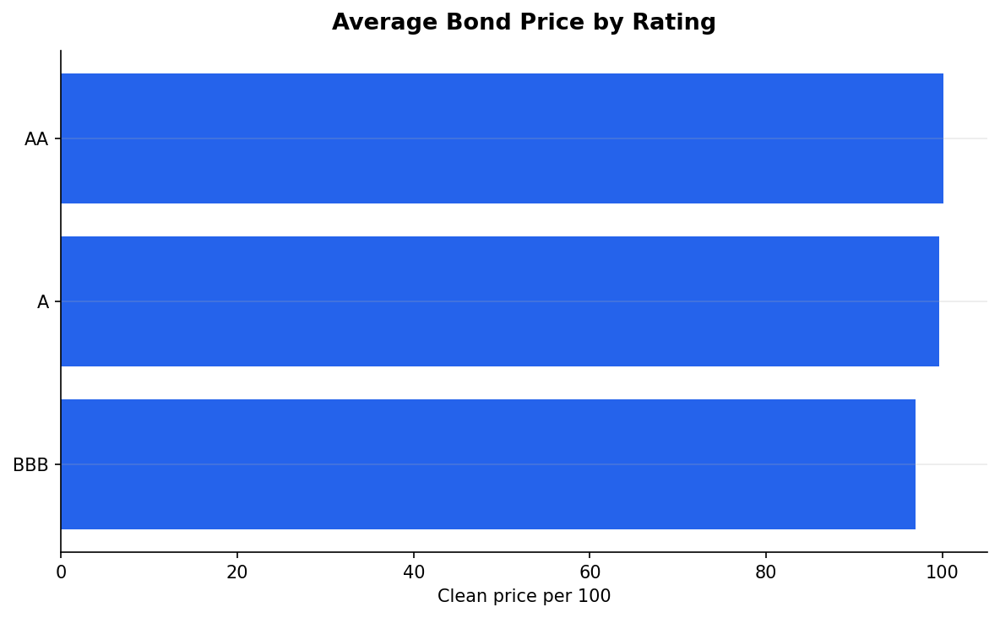
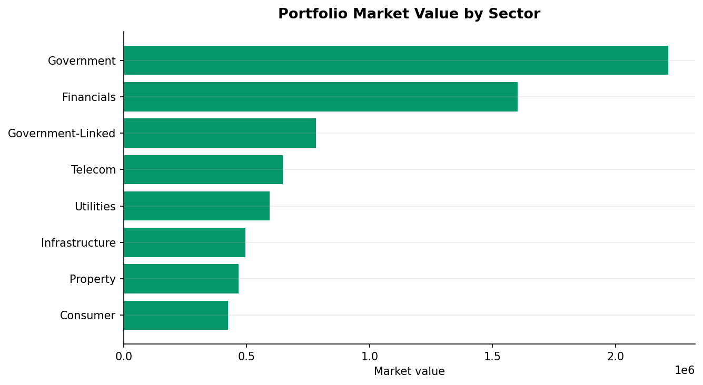
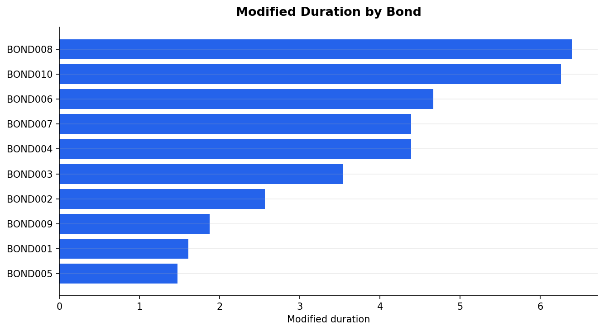
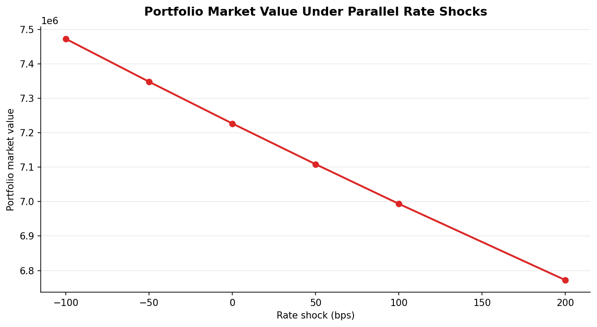
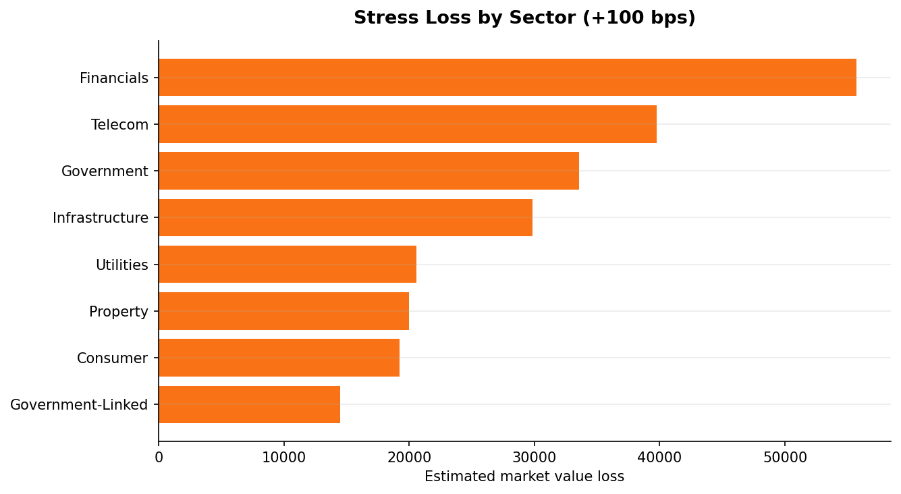

# Fixed Income and Balance Sheet Analytics Platform

Fixed income analytics portfolio project that prices a synthetic bond book, models cash flows, calculates YTM, measures duration/convexity/DV01, and runs interest-rate stress scenarios.

**Disclaimer:** This is a portfolio analytics project. The bond book is synthetic and used for learning only. Nothing here is investment advice, real portfolio data, or a production treasury system.

## Business Problem

Treasury, risk, banking, insurance, and investment teams need a clear view of how bond portfolios behave when interest rates move. A useful fixed income workflow should connect bond cash flows, valuation, yield-to-maturity, duration, convexity, DV01, and scenario losses in a way that can be reviewed by both finance and analytics stakeholders.

## Target Roles and Companies

Target roles:

- Fixed income analyst
- Treasury analyst
- Risk analytics analyst
- Balance sheet analytics analyst
- Investment analytics analyst
- Financial data analyst

Target companies:

- JPMorgan Chase
- Wells Fargo
- ING Hubs Philippines
- AIA Philippines
- BSP
- MSCI
- BPI
- First Metro
- Manulife
- PwC Philippines

## Synthetic Bond Book

The project uses a synthetic book of 10 fixed-rate bullet bonds. It includes issuer type, sector, face value, coupon, coupon frequency, issue date, maturity date, market yield, credit rating, and book value.

The dataset is intentionally synthetic so the project can show fixed income mechanics without implying access to confidential bank, insurer, or client holdings.

## Methodology

1. Create a synthetic bond book.
2. Generate future coupon and principal cash flows.
3. Price each bond using discounted cash flows.
4. Recover yield-to-maturity from model price.
5. Calculate Macaulay duration, modified duration, convexity, and DV01.
6. Reprice the portfolio under parallel rate shocks.
7. Summarize sector, rating, and balance-sheet sensitivity.

## Pricing Engine Summary

Phase 0 prices fixed-rate bullet bonds using scheduled coupon and principal cash flows discounted at a flat bond-level market yield. The project also calculates YTM from model price using a transparent root-solving approach.

Outputs:

- `data/processed/synthetic_bond_book.csv`
- `outputs/bond_book/bond_cashflows.csv`
- `outputs/pricing/bond_pricing_results.csv`
- `outputs/pricing/portfolio_pricing_summary.csv`

## Risk Analytics Summary

Phase 1 adds:

- Macaulay duration
- Modified duration
- Convexity
- DV01
- Portfolio weighted duration and convexity
- Portfolio DV01

Outputs:

- `outputs/scenarios/bond_risk_metrics.csv`
- `outputs/scenarios/portfolio_risk_summary.csv`

## Stress Testing Summary

The stress test applies parallel shocks of:

- `-100 bps`
- `-50 bps`
- `0 bps`
- `+50 bps`
- `+100 bps`
- `+200 bps`

Outputs:

- `outputs/scenarios/rate_stress_results.csv`
- `outputs/scenarios/rate_stress_summary.csv`
- `outputs/scenarios/simple_alm_summary.csv`

## Key Findings

- Portfolio market value: about `7.23 million`
- Portfolio Macaulay duration: `3.40`
- Portfolio modified duration: `3.31`
- Portfolio convexity: `17.37`
- Portfolio DV01: about `2,393`
- `+100 bps` shock: modeled loss of about `233,124`, or `3.23%`
- `+200 bps` shock: modeled loss of about `454,506`, or `6.29%`
- Largest `+100 bps` sector stress loss: Financials
- Largest `+100 bps` rating stress loss: BBB bonds

## Selected Visuals

### Bond Prices by Rating



Average modeled clean price by credit rating in the synthetic book.

### Market Value by Sector



Sector-level market value concentration.

### Duration by Bond



Modified duration by bond, showing which positions are more rate-sensitive.

### Portfolio Value Under Rate Shocks



Modeled portfolio value under parallel interest-rate shocks.

### Stress Loss by Sector



Estimated sector losses under a `+100 bps` rate shock.

## Repo Structure

```text
fixed-income-balance-sheet-analytics/
  data/
    raw/
    processed/
  notebooks/
    01_bond_pricing_engine.ipynb
    02_risk_analytics_and_stress_testing.ipynb
  src/
    cashflows.py
    pricing.py
    risk.py
    scenarios.py
    visualization.py
  reports/
    figures/
    research_memo.md
    model_notes.md
    resume_bullets.md
    interview_talking_points.md
    company_positioning.md
    linkedin_post.md
  outputs/
    bond_book/
    pricing/
    scenarios/
  docs/
```

## How to Run

```bash
cd projects/fixed-income-balance-sheet-analytics
python3 -m venv .venv
source .venv/bin/activate
pip install -r requirements.txt
```

Run Phase 0:

```bash
python3 -m jupyter nbconvert --to notebook --execute notebooks/01_bond_pricing_engine.ipynb --output 01_bond_pricing_engine_executed.ipynb
```

Run Phase 1:

```bash
python3 -m jupyter nbconvert --to notebook --execute notebooks/02_risk_analytics_and_stress_testing.ipynb --output 02_risk_analytics_and_stress_testing_executed.ipynb
```

## Generated Artifacts Policy

The following are generated and ignored by Git:

- `data/raw/**`
- `data/processed/**`
- `outputs/**`

Run the notebooks in order to regenerate the bond book, cash flows, pricing outputs, and stress outputs.

## Limitations

- Synthetic bond book only.
- Simple Actual/365 timing.
- Flat bond-level yields instead of a real yield curve.
- No accrued interest, settlement calendar, or business-day adjustment.
- Parallel rate shocks only.
- No credit spread, liquidity, optionality, callable bond, or default modeling.
- No liability-side balance sheet model.

## Future Improvements

- Add real yield curve construction.
- Add key-rate duration.
- Add credit spread scenarios.
- Add liability cash flows for ALM gap analysis.
- Add callable or amortizing bond examples.
- Add optional dashboard after the analytics workflow is complete.

## Resume Bullet

Built a fixed income analytics project in Python that prices a synthetic bond portfolio, generates coupon cash flows, calculates YTM, duration, convexity, and DV01, and runs parallel interest-rate stress scenarios with balance sheet interpretation.
