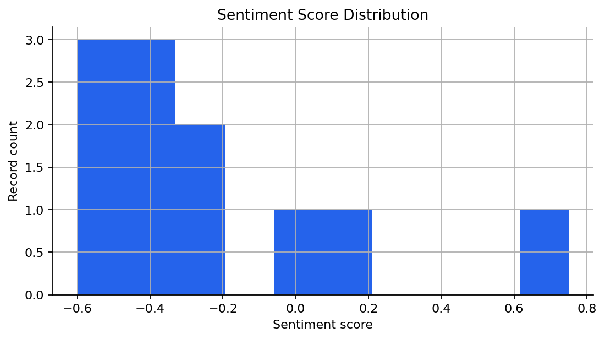
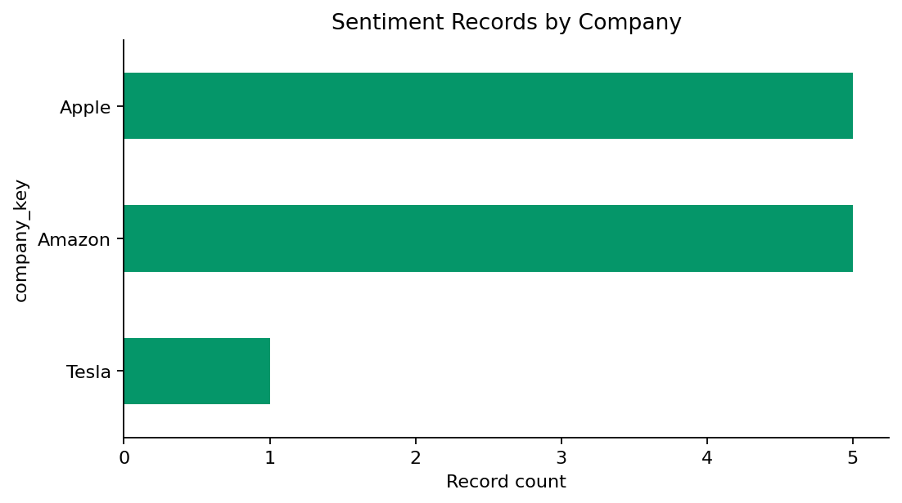
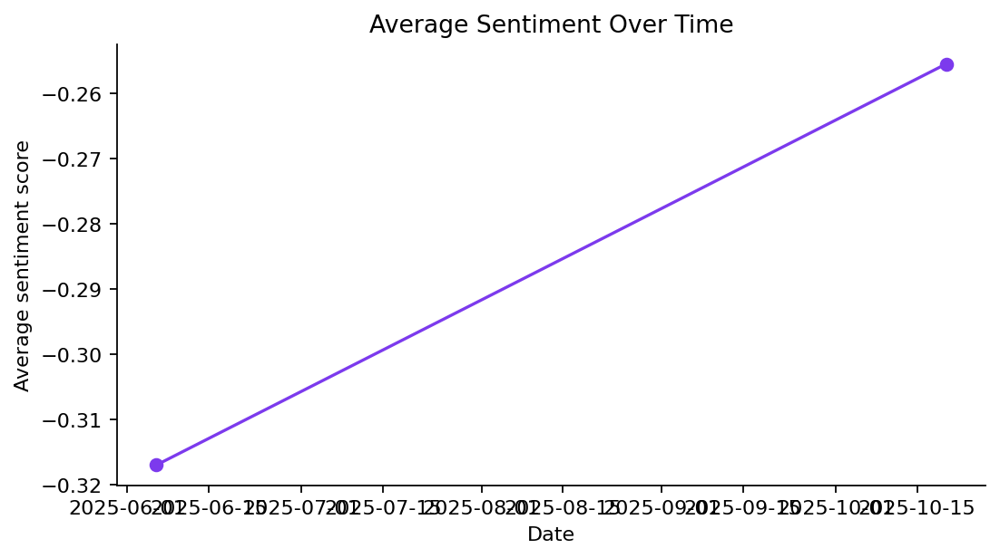
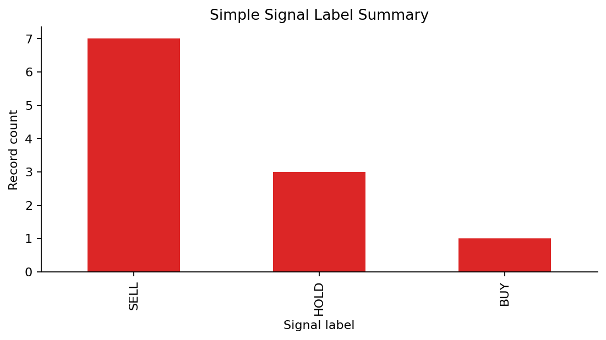
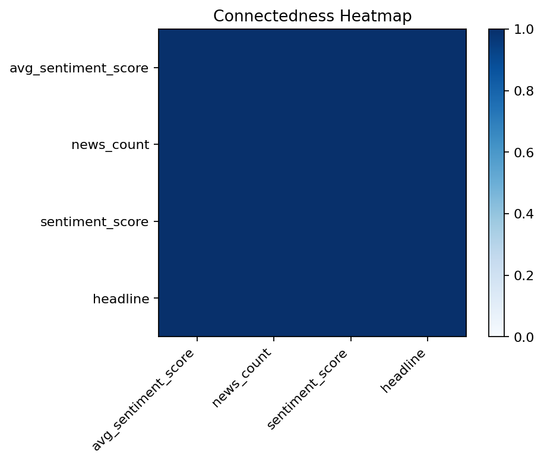

# News Sentiment and Market Connectedness Engine

Financial research analytics project that cleans a recovered news sentiment prototype, scores headlines, merges sentiment with market data, and builds a transparent connectedness view.

**Disclaimer:** This is a portfolio research project, not trading advice, investment advice, or a live trading recommendation system. Signal labels are research tags only.

## Business Problem

Market research teams often want to connect news sentiment with market movement, but prototypes can become hard to reproduce when raw files, scripts, model calls, and market joins are scattered. This project turns a recovered prototype into a cleaner research workflow with documented data limits, safer environment handling, reproducible outputs, and honest connectedness assumptions.

## Target Roles and Companies

Target roles include market research analyst, finance analytics analyst, risk analytics analyst, investment data analyst, fintech analytics analyst, and data analyst.

Target companies include JPMorgan Chase, MSCI, ING Hubs Philippines, Wells Fargo, First Metro, BPI, PwC Philippines, KPMG Philippines, fintech analytics teams, and market research teams.

## Prototype Source Disclaimer

This repo started from local prototype files:

- `sentiment_log.csv`
- `merged_data.json`
- `scraped_news.csv`
- legacy Python scripts under `legacy/`

The data is small and incomplete. The project is useful as a research workflow demonstration, not as evidence of a tradable strategy.

## Environment Setup

Create a local `.env` file from the placeholder file:

```bash
cp .env.example .env
```

Use placeholders like this in `.env.example`:

```text
OPENAI_API_KEY=your_openai_api_key_here
OPENAI_MODEL=gpt-4o-mini
```

`.env` is ignored by Git. Do not commit local credentials.

## Methodology

1. **Audit and restructure:** Inspect recovered raw files and preserve legacy scripts under `legacy/`.
2. **Sentiment standardization:** Clean dates, companies, tickers, sentiment scores, labels, and signal fields.
3. **OpenAI structured scoring:** When a local key is available, score headlines into JSON fields: company, ticker, score, label, confidence, rationale, risk flags, and research signal.
4. **Fallback scoring:** If OpenAI scoring is unavailable, use transparent keyword scoring.
5. **Signal labels:** Assign `SELL`, `HOLD`, or `BUY` as research labels only.
6. **Market merge:** Standardize recovered AMZN market columns and merge daily sentiment to market fields by date.
7. **Connectedness:** Use formal GFEVD only when data supports it; otherwise use an absolute-correlation fallback.

## Data Audit Summary

- `sentiment_log.csv`: 11 usable records.
- `merged_data.json`: 2 merged daily records with AMZN market fields.
- `scraped_news.csv`: present but empty.
- Legacy scripts: recovered and sanitized for committed use.

## Scoring and Signal Summary

Sentiment labels:

- negative: score <= `-0.15`
- neutral: `-0.15 < score < 0.15`
- positive: score >= `0.15`

Research signal labels:

- `SELL`: score <= `-0.25`
- `HOLD`: `-0.25 < score < 0.25`
- `BUY`: score >= `0.25`

Latest local run:

- OpenAI structured scoring ran for 11 headlines.
- Signal labels: 6 `SELL`, 3 `HOLD`, 2 `BUY`.
- These are research labels, not recommendations.

## Connectedness Method

Formal GFEVD was not used because the recovered merged dataset has only two observations and incomplete market values. The project uses an absolute-correlation connectedness fallback to show the workflow shape while keeping the statistical limitation clear.

## Key Findings

- The recovered data is concentrated on two dates: 2025-06-06 and 2025-10-20.
- Company coverage is Apple, Amazon, and Tesla.
- The merged market file contains AMZN columns, but only one row has complete market values.
- Connectedness output is exploratory and should not be interpreted as a reliable spillover estimate.

## Selected Visuals



Sentiment score distribution from the improved scoring run.



Recovered sentiment records by company.



Average sentiment by available date.



Research signal label counts.



Correlation-based connectedness fallback.

## Repo Structure

```text
news-sentiment-market-connectedness-engine/
  data/
    raw/                 Ignored local raw prototype files
    processed/           Ignored generated processed data
    sample/              Optional sample data
  legacy/                Recovered prototype scripts
  notebooks/
    01_project_audit_and_data_review.ipynb
    02_sentiment_market_merge_and_connectedness.ipynb
  src/                   Reusable ingestion, sentiment, merge, and connectedness helpers
  outputs/               Ignored regenerated outputs
  reports/               Research memo, methodology notes, career reports, figures
  docs/                  Brief, decisions, progress, handoff, known issues
```

## How to Run

```bash
cd projects/news-sentiment-market-connectedness-engine
python3 -m venv .venv
source .venv/bin/activate
pip install -r requirements.txt

cp .env.example .env
# Fill .env locally if rerunning OpenAI scoring.

python3 -m jupyter nbconvert --to notebook --execute notebooks/01_project_audit_and_data_review.ipynb --output 01_project_audit_and_data_review_executed.ipynb
python3 -m jupyter nbconvert --to notebook --execute notebooks/02_sentiment_market_merge_and_connectedness.ipynb --output 02_sentiment_market_merge_and_connectedness_executed.ipynb
```

## Generated Artifacts Policy

Raw data, processed data, and output CSVs are ignored by Git because they can contain local prototype data and can be regenerated. Reports, docs, notebooks, source code, legacy scripts, and selected figures are committed for portfolio review.

## Limitations

- Very small recovered dataset.
- Empty scraped news file.
- Incomplete market values.
- No scraping in the final committed workflow.
- No backtest or trading-performance claim.
- Correlation fallback instead of formal GFEVD.
- OpenAI scoring reruns require a local `.env` file.

## Future Improvements

- Recover or rebuild a larger scraped news dataset.
- Add more tickers and dates.
- Improve market-data completeness.
- Validate sentiment scoring against human labels.
- Run formal GFEVD only after enough clean time-series observations exist.
- Add dashboard or API only after data quality improves.

## Resume Bullet

Built a Python research workflow that cleans financial news sentiment logs, safely scores headlines with structured OpenAI output and fallback rules, merges sentiment with market data, and documents connectedness limits without making trading-performance claims.
