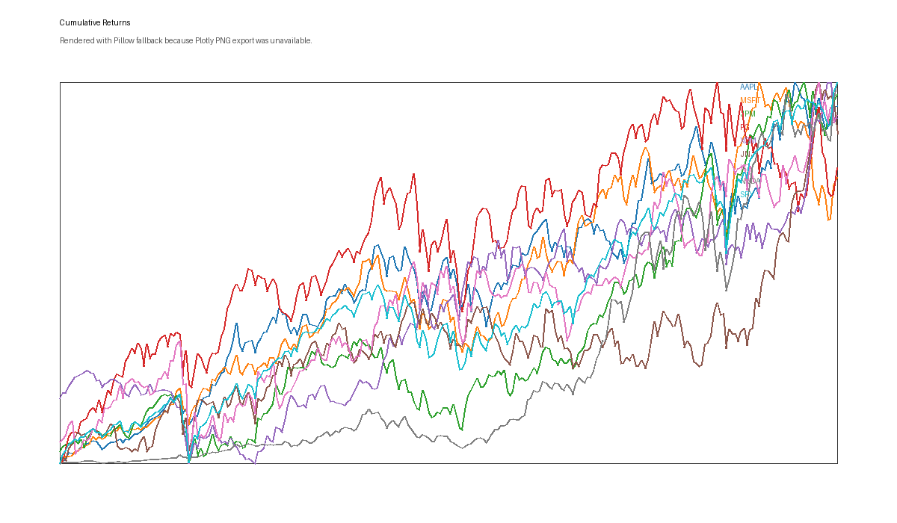
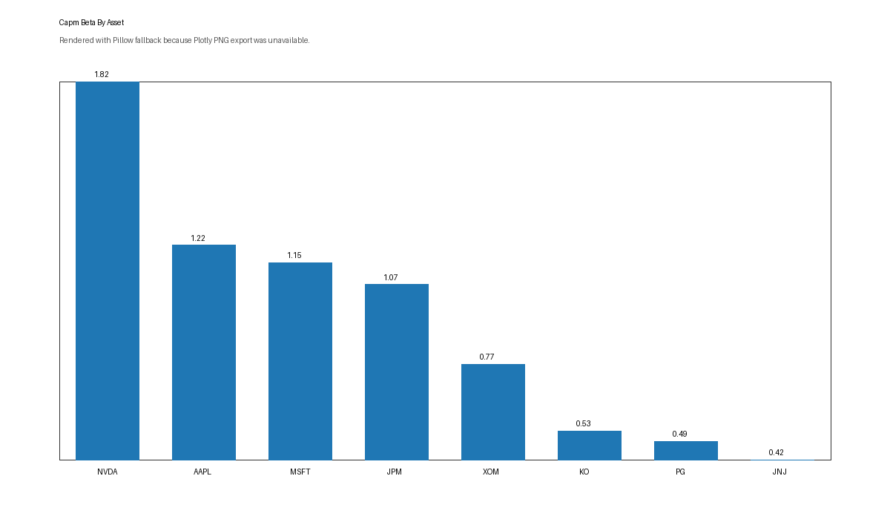
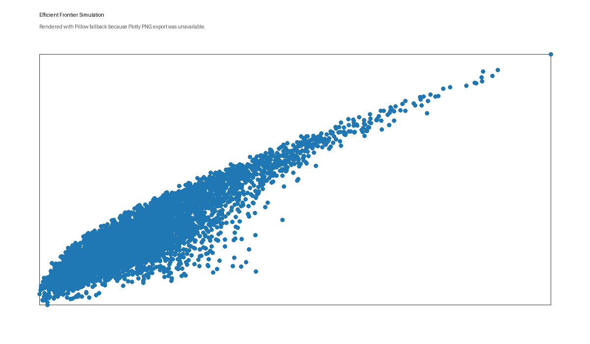
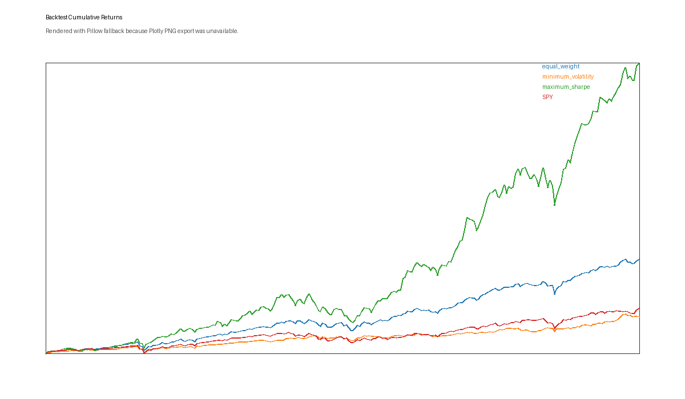
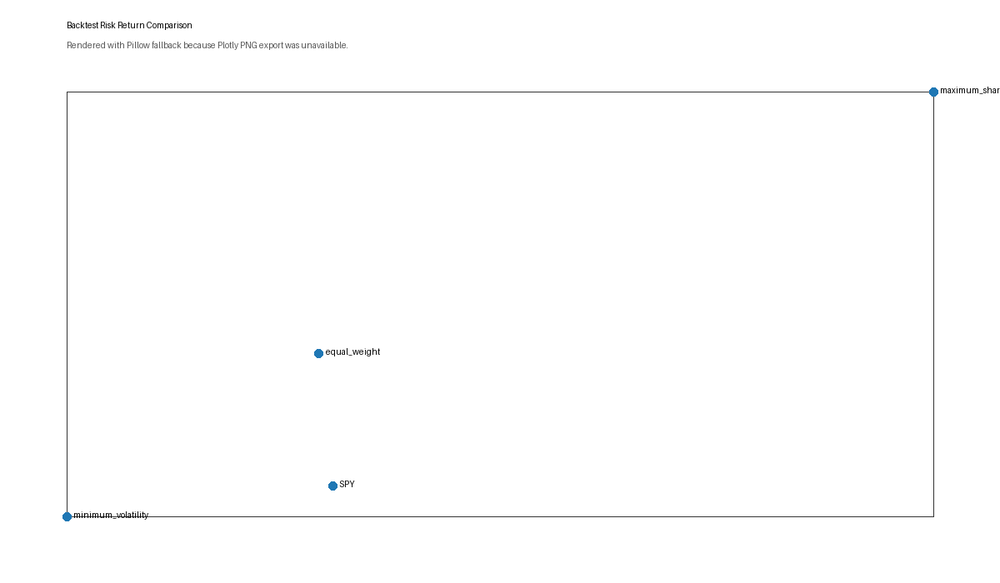

# Portfolio Optimization and Factor Research Lab

Python portfolio research project that analyzes market returns, CAPM sensitivity, portfolio optimization, and fixed-weight backtests for a large-cap equity universe.

## Why This Project Matters

Finance and analytics teams need analysts who can connect market data, risk drivers, portfolio construction, and business interpretation. This project demonstrates that workflow end to end with Python, reproducible notebooks, clear assumptions, and employer-readable outputs.

## Business Problem

Investment, research, corporate finance, and risk teams often need to answer practical questions:

- Which assets have higher or lower sensitivity to the market?
- How do return, volatility, drawdown, and correlation compare across securities?
- What happens when a portfolio is built for equal weight, lower volatility, or higher historical Sharpe ratio?
- How do these strategies perform against a benchmark?

## Target Roles and Companies

Target roles include investment analyst, financial data analyst, market research analyst, corporate finance analyst, risk analytics analyst, quantitative research intern, and fintech analytics analyst.

Target companies include JPMorgan Chase, MSCI, Wells Fargo, P&G Philippines, BPI, First Metro, ING Hubs Philippines, PwC Philippines, BSP, PIDS, and related finance or analytics employers.

## Asset Universe and Benchmark

- Asset universe: `AAPL`, `MSFT`, `JPM`, `PG`, `XOM`, `JNJ`, `KO`, `NVDA`
- Benchmark: `SPY`
- Data source: Yahoo Finance through `yfinance`
- Period: `2019-01-01` to latest available data at notebook execution

## What The Project Does

- Downloads adjusted close prices and calculates daily and monthly returns.
- Summarizes annualized return, volatility, Sharpe ratio, drawdown, and correlations.
- Estimates CAPM-style beta, alpha, benchmark correlation, and rolling beta versus SPY.
- Builds equal-weight, minimum-volatility, and maximum-Sharpe portfolios.
- Runs a simple fixed-weight historical backtest for each strategy against SPY.
- Produces research notes, career positioning materials, and GitHub-ready documentation.

## Key Findings

- `NVDA` had the highest CAPM beta at about `1.82`, while `JNJ` had the lowest beta at about `0.42`.
- `MSFT` had the highest benchmark correlation at about `0.79`.
- The maximum-Sharpe portfolio had the highest fixed-weight historical Sharpe ratio at about `1.63`.
- The equal-weight portfolio had a Sharpe ratio of about `1.37` and the highest correlation to SPY among portfolio strategies.
- The minimum-volatility portfolio had the least severe portfolio-strategy drawdown at about `-30.26%`.

## Selected Visuals



Asset-level cumulative returns for the selected equity universe and SPY benchmark.



Benchmark sensitivity comparison showing higher-beta and more defensive assets.



Random long-only portfolio simulation showing risk-return tradeoffs.



Fixed-weight strategy cumulative returns versus SPY.



Strategy-level risk-return comparison across the backtest period.

## Methodology

1. Market data and returns: download prices, calculate daily/monthly returns, summarize risk and return.
2. CAPM research: estimate beta, alpha, benchmark correlation, tracking error, and rolling beta versus SPY.
3. Portfolio optimization: compare equal-weight, minimum-volatility, and maximum-Sharpe allocations.
4. Backtesting: apply fixed Phase 3 weights over the full available return history and compare against SPY.
5. Interpretation: document findings, assumptions, limitations, and career-facing talking points.

## Repo Structure

```text
portfolio-optimization-factor-lab/
  data/
    raw/
    processed/
    external/
  notebooks/
    01_market_data_and_returns.ipynb
    02_capm_factor_research.ipynb
    03_portfolio_optimization.ipynb
    04_backtesting_and_interpretation.ipynb
  src/
    config.py
    data_loader.py
    returns.py
    factors.py
    optimization.py
    backtesting.py
    visualization.py
  reports/
    research_memo.md
    model_notes.md
    resume_bullets.md
    interview_talking_points.md
    company_positioning.md
    linkedin_post.md
    figures/
  outputs/
    returns/
    factors/
    portfolios/
    backtests/
  docs/
```

## How To Run

Create and activate a virtual environment:

```bash
python3 -m venv .venv
source .venv/bin/activate
```

Install requirements:

```bash
pip install -r requirements.txt
```

Run notebooks in order:

```bash
jupyter nbconvert --to notebook --execute notebooks/01_market_data_and_returns.ipynb --output 01_market_data_and_returns_executed.ipynb
jupyter nbconvert --to notebook --execute notebooks/02_capm_factor_research.ipynb --output 02_capm_factor_research_executed.ipynb
jupyter nbconvert --to notebook --execute notebooks/03_portfolio_optimization.ipynb --output 03_portfolio_optimization_executed.ipynb
jupyter nbconvert --to notebook --execute notebooks/04_backtesting_and_interpretation.ipynb --output 04_backtesting_and_interpretation_executed.ipynb
```

## Outputs Generated

Return outputs:

- `outputs/returns/daily_returns.csv`
- `outputs/returns/monthly_returns.csv`
- `outputs/returns/asset_performance_summary.csv`
- `outputs/returns/correlation_matrix.csv`

Factor outputs:

- `outputs/factors/capm_metrics.csv`
- `outputs/factors/single_index_regression.csv`
- `outputs/factors/rolling_beta.csv`
- `outputs/factors/factor_summary.csv`

Portfolio and backtest outputs:

- `outputs/portfolios/portfolio_weights.csv`
- `outputs/portfolios/portfolio_summary.csv`
- `outputs/portfolios/random_portfolios.csv`
- `outputs/backtests/backtest_metrics.csv`
- `outputs/backtests/strategy_daily_returns.csv`
- `outputs/backtests/strategy_cumulative_returns.csv`
- `outputs/backtests/strategy_drawdowns.csv`

## Generated Artifacts

- Raw and processed market data are not intended to be committed.
- Generated CSV outputs under `outputs/` may be regenerated by rerunning the notebooks.
- Figure files under `reports/figures/` may be regenerated from the notebooks.
- The repository keeps source code, notebooks, docs, and reports visible for review.

## Key Reports

- [Research memo](reports/research_memo.md)
- [Model notes](reports/model_notes.md)
- [Resume bullets](reports/resume_bullets.md)
- [Interview talking points](reports/interview_talking_points.md)
- [Company positioning](reports/company_positioning.md)
- [LinkedIn post drafts](reports/linkedin_post.md)

## Limitations

- Historical returns are descriptive and do not imply future performance.
- The fixed-weight backtest is not walk-forward or out-of-sample validation.
- No transaction costs, taxes, liquidity limits, turnover constraints, or rebalancing schedule are included.
- SPY is a broad benchmark proxy, not a full multi-factor risk model.
- Local environment limitations required fallback methods for some statistical and optimization steps.

## Future Improvements

- Add walk-forward optimization and periodic rebalancing.
- Add transaction costs and turnover analysis.
- Add factor data beyond SPY.
- Add active return, tracking error, and attribution analysis.
- Add optional screenshots or a lightweight dashboard after the GitHub version is polished.

## Resume Bullet

Built a Python portfolio research lab using public market data to calculate returns, CAPM beta, optimized long-only portfolios, and fixed-weight backtests versus SPY, producing research outputs and recruiter-ready documentation for finance analytics roles.

## Interview Talking Points Summary

- Explain why SPY was used as a benchmark.
- Discuss the difference between beta, volatility, drawdown, and Sharpe ratio.
- Compare equal-weight, minimum-volatility, and maximum-Sharpe portfolios.
- Explain why fixed-weight backtests can overstate performance.
- Describe how the workflow could be improved with walk-forward validation and transaction costs.

## Disclaimer

This is a portfolio research project for analytics and career demonstration. Results are historical research outputs, not investment advice, trading recommendations, or a production asset management system.
